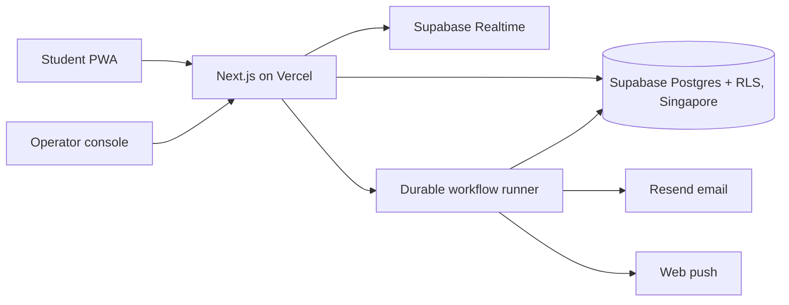
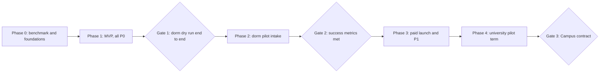

# DormMate SaaS — Product Requirements Document

Oct 3, 2026 · Yhasmen Nogales · v2 (after design review)

Companion docs: [User journeys](user-journeys.md) · [Site map](site-map.md) · [System architecture](system-architecture.md)

## Overview

DormMate SaaS is a roommate-matching platform that housing operators run and students use for free. It turns the DormMate research prototype, an algorithms course project from the Polytechnic University of the Philippines, into a multi-tenant product that private dormitories, boarding-house operators and universities can configure, run and audit.

The prototype showed that lifestyle compatibility can be scored from student profiles and turned into pairings with a heuristic assignment. Its stated limits (no live database, simulated messaging, no landlord integration, no identity verification, Android only) become the v1 product scope.

**Vision:** every student who shares a room is placed with someone they chose or were well matched with, and housing staff spend their time on exceptions instead of complaints.

| Area | Prototype (paper) | SaaS product |
| --- | --- | --- |
| Customer | None; course project | Housing operators pay; students use it free |
| Data | In-memory structures, CSV/JSON files | Multi-tenant PostgreSQL (Supabase), one isolated workspace per operator |
| Matching input | Free-text keywords scanned with Boyer-Moore | Structured, habits-only questionnaire with weights and deal-breakers |
| Matching output | Greedy pairing over merge-sorted scores | Constraint-aware assignment with mutual roommate requests, open-bed filling, manual overrides, audit log |
| Messaging | Simulated, pre-written messages | Real-time, moderated group chat per published room |
| Platform | Android mock-up | Operator web console plus an installable student web app (PWA) |

## Problem and opportunity

Students who live away from home are paired with roommates by word of mouth, Facebook groups or a manager's random assignment, none of which looks at sleep, cleanliness, noise, schedules or social habits. The paper reports that this leads to conflict, stress, complaints and appeals, and early termination of housing contracts, which falls on dorm staff and landlords as administrative work.

| Who | Pain today | Cost to them |
| --- | --- | --- |
| Student | Shares a small room with a stranger chosen without regard to habits | Conflict, stress, lower satisfaction with housing |
| Private dorm or boarding-house owner | Fills beds one at a time through referrals and Facebook posts | Vacancies after early move-outs, tenant churn, caretaker time on disputes |
| University housing office | Assigns beds manually or at random each term; handles swap requests and complaints | Staff hours each term, appeals, unhappy residents |

The research cited in the paper supports the need:

- A survey of flat-sharers found 51.4% prioritize a compatible roommate over the flat itself ([Bhatra et al., 2023](https://doi.org/10.25215/1104.174)).
- Roommate relationships rank second only to room quality in the academic quality of student life ([Perach and Anily, 2022](https://doi.org/10.1016/j.ejor.2021.12.048)).
- Roommate pairing affects academic outcomes: a study of over 5,000 undergraduates found peer effects on performance ([Cao et al., 2024](https://doi.org/10.1038/s41467-024-49228-7)).

The paper also states that no dedicated roommate-matching system exists for Philippine dormitories. That claim and the size of the market are unverified here; see Risks and open questions.

## Customers and personas

The buyer is the housing operator and the daily user is the student, so the product is sold business-to-business and adopted business-to-student. **The first segment is private dormitories and boarding houses around Metro Manila universities**: they buy faster, need no single sign-on, and fill beds all year. Universities follow as a second track through a free pilot.

| Persona | Role in the sale | Goal | What they need from the product |
| --- | --- | --- | --- |
| Dorm or boarding-house owner | Buyer and Owner role (first segment) | Keep beds full, reduce tenant churn | Self-serve setup in under an hour, invite links, open-bed filling, low price |
| Dorm manager or caretaker | Manager or Staff role | Place new tenants quickly, handle disputes | Applicant ranking per open bed, bulk approve, reports inbox |
| Housing director (university) | Economic buyer (second track) | Fewer complaints and swap requests, defensible assignments | Reports, audit trail, control over rules |
| Residence-life staff | Manager role | Finish term assignments quickly | CSV import, preview before publishing, manual overrides |
| Student | End user, pays nothing | Live with someone compatible, or with a friend | Short questionnaire, roommate requests, clear reasons, safe room chat |
| IT and data-privacy officer | Blocker or approver | Keep student data protected | Single sign-on, data-processing agreement, retention controls |

## Goals, non-goals and scope

v1 succeeds if one private dorm fills an intake and its open beds through DormMate, and its owner and students prefer it to the previous process.

**Goals**

- Let a dorm owner sign up, set up properties and rooms, invite students and publish assignments without help, in under an hour of setup.
- Produce roommate pairings that students rate as compatible, with a plain-language reason for each.
- Support two assignment flows: a **batch run** for a whole cycle and **open-bed filling** against current occupants.
- Honor mutual roommate requests whenever they fit.
- Keep every assignment explainable and reversible, with an audit log.
- Protect student data well enough to pass a privacy review under the Data Privacy Act of 2012.

**Non-goals for v1**

- A listings marketplace for finding a dorm or room.
- Lease, payment or rent-collection management for students.
- Background checks. Identity comes from a verified email or the institution's login.
- Psychometric claims, and any religion or other sensitive-category questions.
- Swipe-style student choice and hybrid modes (P1).
- Native app-store apps. v1 ships as a web console and an installable progressive web app.
- Automated billing. Paid customers are invoiced by hand until P1.

**In scope for v1:** self-serve operator sign-up with trial, properties and cycles, invite links and CSV import, habits-only questionnaire, mutual roommate requests, batch matching, open-bed filling, manual overrides, publish and notify (email and web push), room group chat with reporting, audit log, staff roles, guardian-consent recording for minors.

## Functional requirements

v1 has 29 requirements across the student app and the operator console; 21 are P0 (must ship for the dorm pilot), 8 are P1 (needed before or soon after paid launch).

**Student app**

| ID | Requirement | Priority |
| --- | --- | --- |
| S-1 | Join a cycle from an invite link or QR code and sign in with an email one-time code; Campus tenants sign in through SAML single sign-on instead | P0 |
| S-2 | See a consent screen before the questionnaire, enter a birthdate, and answer one required gender question (female, male, or prefer not to say) used only for room gender policy; students under 18 cannot be matched until staff record guardian consent (A-11) | P0 |
| S-3 | Complete a habits-only questionnaire: sleep and wake times, cleanliness, noise, guests, study habits, class schedule, smoking, social style and preferred room location. Each answer can be marked as a deal-breaker and given an importance of 1 to 3 | P0 |
| S-4 | Edit the profile until the cycle's matching deadline; every change is versioned. A student who already has a profile in another workspace can copy answers in after consenting | P0 |
| S-5 | Request specific roommates, up to the room size minus one. A request counts only when it is mutual | P0 |
| S-6 | See the published assignment with roommates, a 0-100 compatibility score and reasons, for example both are early risers, you differ on guests | P0 |
| S-7 | Chat in a group per published room, and with mutual requesters before publish; report and block controls | P0 |
| S-8 | Install the app to the home screen and opt in to push notifications; email remains the fallback channel | P0 |
| S-9 | Export or delete personal data at any time | P0 |
| S-10 | Accept an assignment, or request one swap with a stated reason | P1 |
| S-11 | Complete short check-in surveys at weeks 2 and 8, and fill in a roommate-agreement template | P1 |
| S-12 | Choice mode: shortlist candidates; a match forms only when both say yes | P1 |

**Operator console**

| ID | Requirement | Priority |
| --- | --- | --- |
| A-1 | Self-serve sign-up with a guided setup checklist (property, rooms, questionnaire, invite). The trial lasts until the first published assignment run, capped at 60 days | P0 |
| A-2 | Create properties, optional buildings, rooms and beds with capacities (2, 3 or 4) and a gender policy per room; create cycles as a fixed term or a rolling intake, with deadlines | P0 |
| A-3 | Generate an invite link and QR code per cycle; approve joins one at a time or in bulk; auto-approve students whose verified email is on an imported roster | P0 |
| A-4 | Import students, current occupants and rooms from CSV, with validation errors shown row by row | P0 |
| A-5 | Choose which questions apply, set category weights, and mark hard constraints | P0 |
| A-6 | Run batch matching; preview the score distribution, the unmatched list and any dropped roommate requests with reasons; lock or override individual placements | P0 |
| A-7 | Fill an open bed: rank approved applicants against the room's current occupants, with occupants fixed in place; flag the room as unscored when no occupant has a profile | P0 |
| A-8 | Publish assignments and notify students by email and web push | P0 |
| A-9 | Keep an audit log of every run, override, approval, consent record and publish, with who did it and when | P0 |
| A-10 | Invite staff and set roles: Owner, Manager, Staff | P0 |
| A-11 | Record the date of a guardian consent form when approving a student under 18 | P0 |
| A-12 | Reports inbox: chat reports and block events, with escalation and resolution notes | P0 |
| A-13 | View a dashboard of profile completion, average score, open beds, swap requests and conflict reports | P1 |
| A-14 | Export final assignments as CSV, then a REST API and webhooks | P1 |
| A-15 | Run choice and hybrid modes: students choose first, then the engine assigns whoever is left | P1 |
| A-16 | Configure SAML single sign-on for Campus tenants | P1 |
| A-17 | Pay invoices online through PayMongo payment links (cards, GCash, Maya, QR Ph) | P1 |

## Matching engine

The engine keeps the paper's core idea, a weighted compatibility score followed by a heuristic assignment, and changes the inputs so it works for any operator. It runs in two modes that share the same scoring.

**Batch run** (a whole cycle; universities each term, dorms at a big intake) has seven steps:

1. **Eligibility.** Only approved students with a complete profile and, if under 18, recorded guardian consent enter the run. Remove every pair that breaks a hard constraint: gender policy, property or building, room capacity, cycle, or a deal-breaker either student marked. A deal-breaker excludes a pair when the similarity in that category is below the workspace's deal-breaker threshold (default 0.5). A student who answers "prefer not to say" to gender is eligible only for rooms whose policy is "any". Exact comparison of structured answers replaces the prototype's Boyer-Moore keyword scan.
2. **Roommate requests.** Mutual requests form request groups (connected students who each requested the other). A group is locked together as a hard constraint if it fits: its size is no larger than an available room, every member passes the room's gender policy, and no member's deal-breaker excludes another. Otherwise the group's requests are dropped, each member is matched normally, and staff see the reason: too large for any room, gender policy conflict, deal-breaker conflict, member not eligible, or no room of that size left.
3. **Scoring.** For each remaining pair, compute a similarity between 0 and 1 for each category (for example, the gap between two wake-up times), then combine them with the operator's weights.
4. **Assignment.** Place locked request groups first. Then sort the scored pairs and take the best available, as in the prototype, and improve the result with swap-based local search.
5. **Larger rooms.** For rooms of 3 or 4, seed groups greedily and improve them by swapping students between rooms to raise the total within-room score; locked request groups move as one unit.
6. **Explain and review.** Attach the top shared traits and the weakest dimension to each placement so staff can preview and override.
7. **Publish and freeze.** Store the inputs, weights and engine version of the run for audit.

**Open-bed filling** (a dorm with existing tenants and one or more vacant beds) uses the same scoring with the current occupants fixed in place. Each applicant is checked against the occupants' hard constraints and deal-breakers, then scored as the mean pair score against every occupant who has a profile. If no occupant has a profile, applicants are ranked on hard constraints only, the room is flagged "unscored", and the occupants are invited to fill in the questionnaire. Staff pick from the ranked list; the choice is logged like an override.

The pair score, where s\_k is the similarity in category k, w\_k the operator's weight for it, and m\_k the pair's mean importance for it (each student rates importance 1 to 3; an unrated category counts as 2):

```latex
m_k(i,j) = \frac{\mathrm{imp}_{i,k} + \mathrm{imp}_{j,k}}{2}
\qquad
S(i,j) = 100 \cdot \frac{\sum_k w_k \, m_k(i,j) \, s_k(i,j)}{\sum_k w_k \, m_k(i,j)}
```

A pair that violates a hard constraint is never scored. Every category's default weight is equal until the first design partner tunes them.

| Prototype component | Product decision |
| --- | --- |
| Boyer-Moore keyword matching | Kept only for an optional free-text 'about me' field (P2); everything else is structured |
| Weighted compatibility score | Kept; categories and weights are per-workspace settings with equal defaults |
| Greedy heuristic assignment | Kept as the fast baseline, plus local-search improvement |
| Merge sort of all pairs | Replaced by the platform's standard stable sort; ranking behavior is the same |
| Irving's stable-roommates algorithm | Moved to P1 with choice mode |
| Hungarian method (in the paper's related work) | Not used for roommates, because it solves two-sided problems such as students to beds, not one pool of people |

**Performance target:** a batch run of 2,000 applicants in one block (about 2 million pairs) finishes in under 60 seconds. This is unmeasured, so it is the first engineering task, before the job architecture is finalized. Scoring grows with the square of the number of applicants, so runs are split into blocks by property, gender policy and room type.

**Learning from outcomes (P2):** once week-2 and week-8 survey results exist, test whether weights learned from real outcomes beat the hand-set defaults, as the machine-learning work cited in the paper suggests (Lamba et al., 2020).

## Platform requirements

DormMate runs as one multi-tenant Next.js application on Vercel, backed by Supabase in the Singapore region. Each operator is a workspace with its own data, settings and users. Full detail is in [System architecture](system-architecture.md).

| Area | Requirement |
| --- | --- |
| Stack | Next.js 16 (TypeScript 6) on Vercel Pro; Supabase Pro for PostgreSQL, Auth, Realtime and Storage; Vercel Workflow for background jobs (confirmed by a Phase 0 test); Resend for email. Layer-by-layer detail is in [System architecture](system-architecture.md) |
| Region | Supabase `ap-southeast-1` and Vercel functions pinned to `sin1`, both Singapore, named as the sub-processor location in each data-processing agreement; in-country hosting is an Enterprise request |
| Accounts | Vercel Pro and Supabase Pro sit under Yhasmen Nogales's account and transfer to the company once ownership is settled |
| Tenancy | Every row carries a workspace ID and PostgreSQL row-level security enforces isolation, so no user query can cross workspaces. Questionnaire, weights, branding and deadlines are per-workspace settings |
| Structure | Workspace → property → building (optional) → room → bed. Matching runs inside a cycle, either a fixed term or a rolling intake |
| Roles | Platform admin (our team); Owner (billing, settings, staff); Manager (runs matching, publishes, overrides, approves joins); Staff (views residents, handles reports, cannot publish); Student (own profile, own room only) |
| Student accounts | One global student account with a separate profile per workspace; answers copy between workspaces only with consent |
| Sign-in | Email one-time code through a custom SMTP provider; SAML single sign-on on Supabase Pro for Campus tenants (50 SSO users a month included, then about $0.015 per user) |
| Data model | Workspace, membership, property, building, room, bed, cycle, invite, enrollment, profile (versioned), questionnaire version, roommate request, match run, placement, occupancy, chat thread, message, report, audit event |
| Background jobs | Matching, imports and notifications run asynchronously, and the console shows progress |
| Notifications | Email and web push in v1 (web push on iOS needs 16.4 or later and the app installed to the home screen); SMS at P1 |
| Integrations | CSV import in v1; CSV export, REST API and webhooks at P1; student-information and housing-system connectors later |
| Availability | 99.5% monthly uptime target (proposed), with extra care during intake windows |
| Security | Encryption in transit and at rest, daily backups (7-day restore on Supabase Pro), role-based access, append-only audit log, and an external penetration test before paid launch |
| Accessibility and language | English at launch with all text translatable from day one; Filipino at P1; WCAG 2.1 AA as the target |
| Observability | Sentry for errors; PostHog for product analytics, with no student personal data sent unless the data-processing agreement lists it |
| Delivery | Operator console and student app in one Next.js app with path-based areas; native wrappers only if the pilot shows a need |



Students and staff reach data only through the app and Supabase, where row-level security checks workspace and role. Matching runs as background jobs and writes to the same workspace-isolated database.

## Business model and pricing

Operators pay an annual subscription priced per bed; students never pay. Per-bed pricing scales with the size of the customer and is easy to budget. Every price below is a hypothesis to test in pilots, not market data.

| Tier | For | Price (hypothesis, PHP) | Includes |
| --- | --- | --- | --- |
| Trial | Every self-serve operator | Free until the first published assignment run, capped at 60 days | All Standard features |
| University pilot | University design partners | Free for one term, up to 300 beds | Campus features, weekly check-ins with our team |
| Standard | Private dorms, small institutions | 150 per bed per academic year, minimum 50 beds | Batch runs, open-bed filling, roommate requests, CSV import, email support |
| Campus | Universities | 250 per bed per academic year, minimum 500 beds | Standard plus single sign-on, custom questionnaire and weights, analytics, audit export, API |
| Enterprise | Dorm chains, multi-campus groups | Custom | Campus plus dedicated support, in-country hosting on request, custom integrations, uptime commitment |

The trial ends at the first published run rather than after a fixed 30 days, because an owner needs time to collect profiles before matching shows its value; the 60-day cap stops open-ended free use.

Illustrative arithmetic: 10 Campus customers with 1,000 beds each (2,500,000) plus 40 Standard customers with 100 beds each (600,000) gives about 3,100,000 PHP a year. That is a modest base for a Philippines-only product, so the plan assumes either a larger bed count per customer or expansion to neighboring markets, and the pilots should test willingness to pay before the price list is fixed.

**Billing:** v1 invoices by hand. At P1, invoices carry PayMongo payment links, which suit annual per-bed invoices and accept GCash. PayMongo's recurring Subscriptions API does not support GCash, and accepting GCash or cards requires DTI or SEC business registration, so billing waits on the company question below.

**Principles**

- Students are never charged, shown ads, or have their data sold; this keeps adoption high and keeps privacy review simple.
- Pricing is per bed, not per match, so operators are not discouraged from re-running matching or filling open beds.
- Later add-ons: premium analytics and paid integration setup.

## Go-to-market

Start with one or two private dorms near a Metro Manila campus, prove one intake and its open beds, then run a university pilot for a full academic term.

1. **Dorm design partners.** Pitch two to three months before an intake. Offer the trial plus hands-on setup to one or two dorms in return for weekly feedback, anonymized outcome data and a named reference.
2. **Prove the result (one intake plus a semester of open beds).** Compare the pilot intake against the dorm's previous one on vacancies filled, disputes, early move-outs and the owner's time. Publish a one-page case study.
3. **Small operators: self-serve.** Reach dorm and boarding-house owners in the Facebook groups where rooms are already advertised, with the trial and a setup that takes under an hour.
4. **Universities: champion-led sales.** A housing director is the champion. The path is a demo, a free university pilot term, then a Campus contract, with the IT and privacy officer involved early so security review does not stall the deal.
5. **Student pull.** Students who like the experience ask their dorm or housing office to adopt it. A shareable 'my compatibility profile' card supports this, with no private answers shown.

## Success metrics

The pilot is a success if students rate their matches well and the owner does less placement work; every target below is a proposal to be baselined against the partner's previous intake.

| Metric | Definition | Target (proposed) | Kind |
| --- | --- | --- | --- |
| Setup time | Operator sign-up to first invite link shared | Under 1 hour | Adoption |
| Profile completion | Approved students who finish the questionnaire by the deadline | 80% or more | Adoption |
| Request honor rate | Mutual roommate requests placed together | 90% or more | Matching quality |
| Assignment acceptance | Published placements not contested | 90% or more | Matching quality |
| Roommate satisfaction | Average week-8 survey rating of the roommate match, 1 to 5 | 4.0 or higher | Outcome |
| Conflict reports | Roommate conflict reports per 100 beds versus the previous intake | 30% lower | Outcome |
| Staff time | Hours spent on placement per intake versus the previous intake | 50% lower | Outcome |
| Match run time | Time to match 2,000 applicants in one block | Under 60 seconds | Performance |
| Trial conversion | Trials that reach a published run and then pay | 30% or more | Business |
| Paying customers | Operators on a paid tier | 10 within 12 months of paid launch | Business |
| Renewal rate | Customers renewing for a second academic year | 80% or more | Business |

## Privacy, fairness and safety

Lifestyle profiles are personal data, so these requirements gate the pilot instead of following it. This is a product specification, not legal advice; counsel should confirm it for each market.

| Area | Requirement |
| --- | --- |
| Legal basis | Philippines first: the Data Privacy Act of 2012 (RA 10173) and National Privacy Commission duties such as breach notification. Each operator signs a data-processing agreement: the operator is the personal information controller and stays accountable for data it transfers for processing (Section 21); DormMate is the processor (Section 14). The agreement names Supabase in Singapore as a sub-processor. FERPA (US) and GDPR (EU) are reviewed before entering those markets |
| Data minimization | Ask only habits the engine uses, plus gender for room gender policy only (never scored or shown to roommates; "prefer not to say" is allowed). No religion, ethnicity, health or other sensitive-category questions in v1 |
| Consent and age | Explicit consent screen before the questionnaire. Students under 18 stay out of matching until staff record the date of a guardian consent form, following NPC Advisory Opinion 2020-046; an in-app guardian flow is P1 |
| Visibility | No pre-match browsing. Roommates see a summary of shared traits, not full answers; contact details stay hidden unless a student shares them in chat |
| Retention and control | Profiles and chats are deleted 90 days after the cycle ends or the student moves out (proposed); students can export or delete their data at any time |
| Fair matching | Operators can set a room gender policy but cannot weight or filter on race, ethnicity, nationality, disability or religion, and the questionnaire does not collect them |
| Bias testing | Before each release, compare scores, request honor rates and acceptance rates across student groups and report the result to tenants |
| Explainability and appeal | Every placement shows its reasons; dropped roommate requests show why; a student can contest an assignment; every staff override is logged |
| Chat safety | Chat exists only between roommates and mutual requesters; report and block controls, keyword filtering, rate limits, and escalation of reports to staff |
| Analytics | Product analytics exclude student personal data unless the data-processing agreement lists the analytics provider |

## Roadmap

The roadmap has five phases and three gates, with no fixed dates. A phase ends when its gate passes, and paid launch waits for a dorm pilot that meets the success metrics. Pilots start at whichever partner intake comes after Gate 1.



| Phase | Contents | Gate to leave it |
| --- | --- | --- |
| 0. Benchmark and foundations | 2,000-applicant matching benchmark; Supabase project in Singapore; row-level security, auth and email one-time codes; repo and CI | Benchmark under 60 seconds, or a decision to move matching to a dedicated worker |
| 1. MVP | All P0 requirements; data-processing agreement and privacy notice drafted | Gate 1: one dorm completes a dry run end to end |
| 2. Dorm pilot | One intake plus open-bed filling for the rest of the semester; weekly feedback | Gate 2: success-metric targets met or explained |
| 3. Paid launch | Penetration test; PayMongo payment links; SMS; Filipino; swap requests; check-in surveys; CSV export; single sign-on | Business registered; first paid invoice |
| 4. University pilot | One academic term with CSV import and single sign-on | Gate 3: housing director signs a Campus contract |

## Risks and open questions

The largest risk is that nobody yet knows whether the algorithm's matches make students happier: the paper evaluates the design and performance of the algorithm, not outcomes with real residents.

| Risk | Mitigation |
| --- | --- |
| Match quality is unproven; category weights are hand-set | Week-2 and week-8 surveys in the pilot; compare against the partner's previous intake; tune weights from results |
| The MVP is large for one or two builders | Benchmark first; build in verifiable units; swipe, hybrid, SMS and Filipino are deferred to P1 |
| Matching benchmark misses 60 seconds | Block runs by property and room type; move matching to a dedicated worker if needed |
| Small Philippine market and low willingness to pay | Test pricing in pilots; plan expansion to neighboring markets; keep a self-serve tier for small operators |
| Slow procurement at public universities | Lead with private dorms; keep the university pilot free and low-effort |
| Breach of sensitive student data | Habits-only questionnaire, tenant isolation, encryption, external penetration test, 90-day retention |
| Single vendor dependency on Supabase | Use standard Postgres features and SQL migrations so the database can move to another Postgres host |
| iPhone students miss push notifications unless they install the app | Email for every notification that matters; prompt to install after joining |
| Students misreport answers to get a preferred roommate | Mutual requests give an honest route to room with friends; check-in surveys; staff review outliers |
| Owners abuse the trial by never publishing | 60-day cap on the trial |
| Housing-management vendors add roommate matching | Integrate through export and API instead of replacing their systems; compete on match quality and local fit |
| Prototype built by five students for a course | Agree on ownership, roles and the university's IP policy before any customer contract |

**Open questions**

- Who owns the code and the paper's ideas, and are the five authors forming a company? This also blocks business registration, which PayMongo needs for GCash and cards.
- Which dorm is the first design partner, and which questions and default weights does it consider valid?
- How many beds are in the Metro Manila market, and what do operators spend on placement today? Neither is verified here.
- Does NPC Circular 2023-04 (Guidelines on Consent) add requirements for minors beyond recording guardian consent? Counsel should read it before the pilot.
- Does Supabase limit the number of SAML connections per project? Not found in its documentation; confirm before signing a second university.
- Does Vercel Workflow pass the Phase 0 test (under 60 seconds in `sin1`, IDs-only step I/O, local dev on Windows, idempotent retry)? If the local-dev or retry checks fail, Inngest is the fallback.

**Settled in this revision:** hosting region (Singapore, with in-country hosting as an Enterprise request), religion deal-breakers (not collected), mobile web versus native (an installable progressive web app), the source of gender for room policy (one onboarding question), the deal-breaker rule (similarity below 0.5), how student importance enters the score (pair mean multiplies the weight), and account ownership (Yhasmen Nogales until the company exists).
