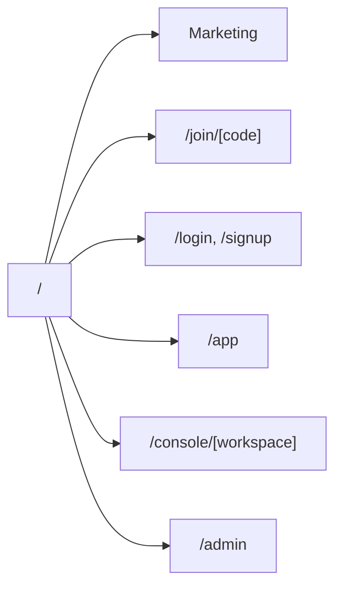
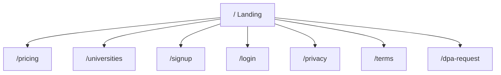
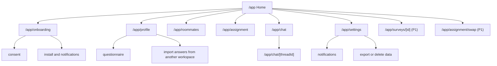
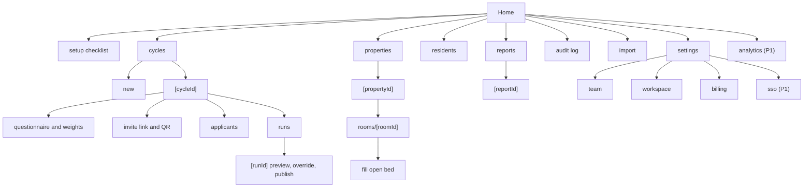

# DormMate — Site Map

Oct 3, 2026 · Yhasmen Nogales · companion to the [PRD](prd.md) and [user journeys](user-journeys.md)

DormMate is one Next.js app with five path-based areas. One deployment and one sign-in cookie serve everything; per-workspace subdomains are an Enterprise option later.

| Area | Path | Who | Purpose |
| --- | --- | --- | --- |
| Marketing | `/` | Public | Explain, price, sign up |
| Join | `/join/[code]` | Public, then student | Land from an invite link or QR code |
| Student app | `/app` | Student | Installable progressive web app, mobile-first |
| Operator console | `/console/[workspace]` | Owner, Manager, Staff | Desktop-first web console |
| Platform admin | `/admin` | Our team | Workspaces, pilots, support |

## Marketing site (public)

| Path | Page | Notes |
| --- | --- | --- |
| `/` | Landing | Problem, how matching works, "Start free" for dorm owners |
| `/pricing` | Pricing | Trial, Standard, Campus, Enterprise; per-bed calculator |
| `/universities` | For universities | Single sign-on, CSV import, audit, pilot offer, contact form |
| `/signup` | Operator sign-up | Email one-time code, then workspace creation |
| `/login` | Sign in | Email one-time code; "Sign in with your university" for SSO tenants |
| `/privacy` | Privacy notice | Data Privacy Act notice; child-friendly summary section |
| `/terms` | Terms of service | — |
| `/dpa-request` | Data-processing agreement request | Form for operators and privacy officers |

## Join flow

| Path | Page | Notes |
| --- | --- | --- |
| `/join/[code]` | Invite landing | Dorm name and logo, what DormMate is, email entry |
| `/join/[code]/verify` | One-time code | Creates or reuses the global student account, then hands off to `/app/onboarding` |
| `/join/expired` | Invalid or rotated link | Contact details for the dorm |

## Student app (`/app`)

Bottom tab bar on mobile: **Home**, **Roommates**, **Chat**, **Profile**. Every screen is scoped to the student's current workspace; a switcher appears only if the student belongs to more than one.

| Path | Screen | Requirement | Notes |
| --- | --- | --- | --- |
| `/app` | Home | — | Status card: pending approval, questionnaire to do, waiting for deadline, or assignment ready |
| `/app/onboarding/consent` | Consent, birthdate and gender | S-2 | Under-18 notice about guardian consent; gender explained as used only for room policy |
| `/app/onboarding/install` | Install and notifications | S-8 | iOS shows add-to-home-screen steps first |
| `/app/profile` | Profile summary | S-4 | Shows version and deadline |
| `/app/profile/questionnaire` | Questionnaire | S-3 | One category per step; deal-breaker toggle and importance per answer |
| `/app/profile/import` | Copy answers from another workspace | S-4 | Requires explicit consent |
| `/app/roommates` | Roommate requests | S-5 | Add by email; shows mutual, waiting, or dropped with reason |
| `/app/assignment` | Assignment | S-6 | Room, roommates' first names, score, reasons |
| `/app/assignment/swap` | Swap request | S-10 (P1) | One per cycle, with reason |
| `/app/chat` | Chat list | S-7 | Room thread and any pre-publish request-group thread |
| `/app/chat/[threadId]` | Chat thread | S-7 | Report and block from message or room menu |
| `/app/settings/notifications` | Notifications | S-8 | Push on or off; email always on for essentials |
| `/app/settings/data` | Your data | S-9 | Export or delete |
| `/app/surveys/[id]` | Check-in survey | S-11 (P1) | Weeks 2 and 8 |

## Operator console (`/console/[workspace]`)

Left sidebar on desktop: **Home**, **Cycles**, **Properties**, **Residents**, **Reports**, **Audit log**, **Settings**. Items a role cannot use are hidden, not disabled.

| Path (after `/console/[workspace]`) | Screen | Requirement | Owner | Manager | Staff |
| --- | --- | --- | --- | --- | --- |
| `/` | Home: open beds, pending joins, open reports, trial status | — | ✓ | ✓ | ✓ |
| `/setup` | Setup checklist | A-1 | ✓ | ✓ | — |
| `/cycles` | Cycle list | A-2 | ✓ | ✓ | view |
| `/cycles/new` | New cycle: term or rolling intake, deadlines | A-2 | ✓ | ✓ | — |
| `/cycles/[id]/questionnaire` | Questions, weights, hard constraints | A-5 | ✓ | ✓ | view |
| `/cycles/[id]/invite` | Invite link and QR code; rotate link | A-3 | ✓ | ✓ | — |
| `/cycles/[id]/applicants` | Approve, bulk approve, reject; record guardian consent | A-3, A-11 | ✓ | ✓ | view |
| `/cycles/[id]/runs` | Run list and "Run matching" | A-6 | ✓ | ✓ | view |
| `/cycles/[id]/runs/[runId]` | Preview, dropped requests, overrides, publish | A-6, A-8 | ✓ | ✓ | view |
| `/properties` | Properties, buildings | A-2 | ✓ | ✓ | view |
| `/properties/[id]` | Rooms and beds, occupancy | A-2 | ✓ | ✓ | view |
| `/properties/[id]/rooms/[roomId]` | Room detail, mark moved out | A-7 | ✓ | ✓ | view |
| `/properties/[id]/rooms/[roomId]/fill` | Fill open bed: ranked applicants | A-7 | ✓ | ✓ | — |
| `/residents` | Students and occupants, profile status | — | ✓ | ✓ | ✓ |
| `/reports` | Reports inbox | A-12 | ✓ | ✓ | ✓ |
| `/reports/[reportId]` | Report detail, resolve or escalate | A-12 | ✓ | ✓ | ✓ |
| `/audit` | Audit log with filters | A-9 | ✓ | ✓ | — |
| `/import` | CSV import for rooms, roster, occupants | A-4 | ✓ | ✓ | — |
| `/settings/workspace` | Name, logo, retention notice | — | ✓ | — | — |
| `/settings/team` | Invite staff, set roles | A-10 | ✓ | — | — |
| `/settings/billing` | Trial status, invoices, payment links (P1) | A-1, A-17 | ✓ | — | — |
| `/settings/sso` | SAML configuration | A-16 (P1) | ✓ | — | — |
| `/analytics` | Dashboard | A-13 (P1) | ✓ | ✓ | view |

## Platform admin (`/admin`)

| Path | Screen | Notes |
| --- | --- | --- |
| `/admin` | Overview | Active workspaces, trials near cap, failed jobs |
| `/admin/workspaces` | Workspace list and creation | Creates university pilot workspaces by hand |
| `/admin/workspaces/[id]` | Workspace detail | Tier, trial override, invoice status; no access to student answers |
| `/admin/jobs` | Background jobs | Matching run timings for the benchmark target |

## Shared and system routes

| Path | Purpose |
| --- | --- |
| `/auth/callback` | Supabase Auth callback for one-time codes and SAML |
| `/api/webhooks/*` | Inbound webhooks (email events; payments at P1) |
| `/api/jobs/*` | Durable workflow endpoints |
| `/manifest.webmanifest`, `/sw.js` | Progressive web app manifest and service worker |
