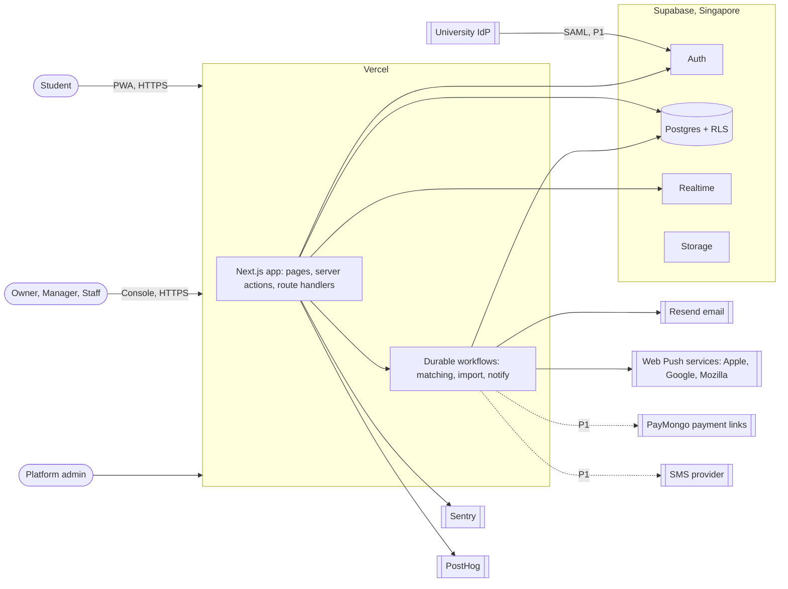
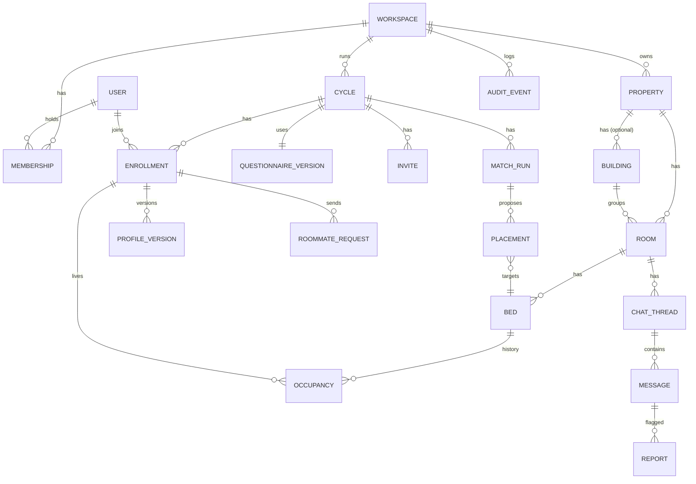
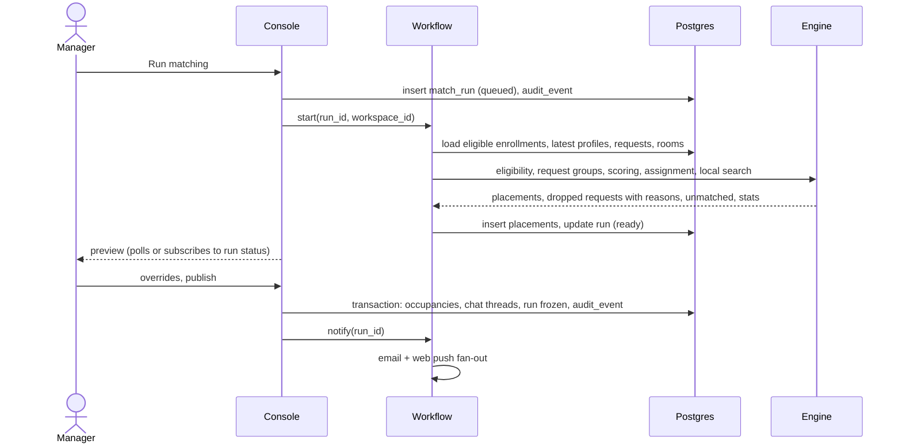

# DormMate — System Architecture

Oct 3, 2026 · Yhasmen Nogales · companion to the [PRD](prd.md) and [site map](site-map.md)

DormMate v1 is one Next.js application on Vercel backed by Supabase in Singapore. It is sized for a team of one or two: one language (TypeScript), one deployment, and managed services for everything that is not the product's core. The core is the matching engine, and it is a plain TypeScript module so it can move to a dedicated worker if the benchmark demands it.

## Decisions

| # | Decision | Why | Revisit when |
| --- | --- | --- | --- |
| 1 | Next.js (TypeScript) on Vercel, one app with path-based areas | One deployment, one cookie, one language | A native app or a separate API consumer appears |
| 2 | Supabase for Postgres, Auth, Realtime and Storage | One vendor; Auth ties directly into row-level security; Realtime covers chat | Supabase limits or pricing block a customer |
| 3 | Region `ap-southeast-1` (Singapore) | Closest Supabase region to Manila; named in data-processing agreements | A customer requires in-country hosting (Enterprise) |
| 4 | Row-level security on every workspace table | Isolation enforced by the database, not by remembering a `WHERE` clause | — |
| 5 | Vercel Workflow for jobs, with run data pinned to `sin1` | Retries and step progress without running a queue; keeps step data in Singapore; GA and included with Vercel Pro | Phase 0 test fails on local dev or retry (fall back to Inngest), or on speed (move the engine to a worker) |
| 6 | Matching engine as a pure TypeScript package | Testable without a database; portable to a worker | — |
| 7 | Resend over custom SMTP for Supabase Auth and app email | Supabase's built-in sender allows only 2 emails an hour and is not for production | — |
| 8 | Web push through the service worker, email as fallback | No app stores; iOS push requires installation | Pilot shows students need native |
| 9 | Sentry for errors, PostHog for product analytics without student personal data | Funnel data for setup-time and completion metrics | — |
| 10 | Append-only audit table, written only by the server | Defensible history of runs, overrides, approvals and publishes | — |
| 11 | Vercel functions pinned to `sin1` (Singapore) | The default region is US East, which would put every database call across the Pacific | — |
| 12 | Publish, override and consent recording as Postgres functions called through `.rpc()` | supabase-js cannot hold a transaction across calls, and the audit row must commit with the action | — |
| 13 | Vercel Pro and Supabase Pro under Yhasmen Nogales's account | Vercel Hobby forbids commercial use; ownership moves to the company once it exists | Company formed |

## Stack

Versions checked against the npm registry on Oct 3, 2026.

| Layer | Choice | Note |
| --- | --- | --- |
| Package manager | pnpm 12 workspaces | No Turborepo while there are only two packages |
| Framework | Next.js 16 App Router, React 19, Turbopack | Sessions refreshed in `proxy.ts` (the renamed middleware) with `getClaims()` |
| Language | TypeScript 6 | TypeScript 7 is released, but Next.js support for it is not yet recommended for production |
| UI | Tailwind CSS 4, shadcn/ui | — |
| Validation | Zod 4 inside server actions, plain `<form>` with `useActionState` | Add react-hook-form only when a form needs it |
| Data access | `@supabase/ssr` and supabase-js 2 with types from `supabase gen types`; no ORM | Transactional actions are Postgres functions (decision 12) |
| Migrations | Supabase CLI, plain SQL in `supabase/migrations` | — |
| Tests | Vitest 5 for the engine; pgTAP via `supabase test db` for row-level security; Playwright for sign-in | — |
| PWA | `app/manifest.ts`, a hand-written `public/sw.js`, `web-push` | No Serwist; no requirement asks for offline caching |
| i18n | next-intl 4 without locale routing, `messages/en.json` | Filipino at P1 |
| Lint and format | Biome 2 | One tool instead of ESLint plus Prettier |
| CI | GitHub Actions: typecheck, Biome, Vitest, `supabase test db`, reduced benchmark | Vercel Git integration deploys |

## System context



## Containers and responsibilities

| Container | Responsibilities | Talks to |
| --- | --- | --- |
| Next.js app (Vercel) | Marketing pages, student PWA, operator console, admin; server actions for writes; route handlers for webhooks and workflow endpoints | Supabase with the user's session; workflow runner |
| Durable workflows (Vercel) | Matching runs, CSV imports, notification fan-out, retention deletion, trial expiry | Supabase with the service role, always scoped to one workspace |
| Supabase Auth | Email one-time codes; SAML for Campus tenants (Pro plan, 50 SSO users a month included, then about $0.015 each) | Resend over SMTP; university identity providers |
| Supabase Postgres | All product data; row-level security; audit log | — |
| Supabase Realtime | Chat delivery on private channels authorized by row-level security policies | Postgres |
| Supabase Storage | Workspace logos, CSV uploads, data exports | — |
| Resend | Auth emails, invites, notifications | — |

## Repository layout

```text
dormmate/
  apps/web/                Next.js app
    app/(marketing)/       / pricing universities privacy terms dpa-request
    app/join/[code]/
    app/app/               student PWA
    app/console/[workspace]/
    app/admin/
    app/api/               webhooks, workflow endpoints
    messages/              next-intl catalogs (en at launch, fil at P1)
  packages/matching/       pure TypeScript engine + benchmark
  supabase/                SQL migrations, RLS policies, pgTAP tests
  docs/                    PRD, journeys, site map, architecture
```

## Tenancy and access control

Every workspace-owned table has a `workspace_id` column and row-level security turned on. Access is decided by a `membership` row (staff) or an `enrollment` row (students).

| Role | Scope | Can |
| --- | --- | --- |
| Platform admin | All workspaces, through admin routes only | Create workspaces, change tiers, view job health; cannot read questionnaire answers or messages |
| Owner | One workspace | Everything a Manager can, plus settings, team and billing |
| Manager | One workspace | Run matching, override, publish, approve joins, record guardian consent, fill open beds |
| Staff | One workspace | View residents and runs, handle reports |
| Student | Own enrollments | Own profile, own requests, own room's assignment and chat; a summary of roommates' shared traits |

Policy shape, for example on `profile`:

```sql
create policy profile_owner on profile
  for all using (user_id = auth.uid());

create policy profile_staff_read on profile
  for select using (
    exists (
      select 1 from membership m
      where m.workspace_id = profile.workspace_id
        and m.user_id = auth.uid()
    )
  );
```

Rules that keep isolation sound:

- User requests always use the user's Supabase session, so row-level security applies.
- The service role key is used only inside workflows, and every workflow takes a `workspace_id` argument that each query filters on.
- Publish, override and consent recording run as server actions that check the role again and write the audit event in the same transaction.

## Data model



| Entity | Key fields | Notes |
| --- | --- | --- |
| `workspace` | name, logo, tier, trial_started_at, trial_ends_at, first_published_at | Trial ends at first publish or 60 days |
| `membership` | workspace_id, user_id, role (owner, manager, staff) | Staff only |
| `property`, `building`, `room`, `bed` | capacity, gender_policy | Building is optional |
| `cycle` | kind (term, rolling), deadline, status, questionnaire_version_id, weights | Matching happens inside a cycle |
| `invite` | cycle_id, code, rotated_at | Rotating invalidates old links |
| `enrollment` | user_id, cycle_id, status (pending, approved, rejected, placed, moved_out), birthdate, gender (female, male, undisclosed), guardian_consent_on, consent_version, on_roster | One per student per cycle; gender is used only for room policy |
| `profile_version` | enrollment_id, answers (jsonb), deal_breakers, importance (1 to 3 per category), created_at | Append-only; latest version at the deadline is used |
| `roommate_request` | from_enrollment, to_email, to_enrollment | Mutual when both directions exist |
| `match_run` | cycle_id, mode (batch, open_bed), engine_version, inputs_hash, weights, status, step, timings | Frozen on publish |
| `placement` | run_id, enrollment_id, bed_id, score, reasons, locked, overridden_by | Proposal until publish |
| `occupancy` | bed_id, enrollment_id, started_on, ended_on | Published reality; current occupants for open-bed filling |
| `chat_thread` | kind (room, request_group), room_id | Members derived from occupancy or mutual requests |
| `message`, `report`, `block` | — | Reports carry status, assignee, resolution note |
| `audit_event` | workspace_id, actor_id, action, target, payload, at | Insert-only; no update or delete grants |
| `push_subscription` | user_id, endpoint, keys | Web push |

## Matching pipeline

The engine is a pure function: `match(input) → { placements, dropped_requests, unmatched, stats }`. The workflow loads the input, calls the engine, and writes the results. That keeps the engine fast to test and benchmark.



| Stage | Detail |
| --- | --- |
| Eligibility | The loader passes only approved enrollments with a complete profile and, if under 18, guardian consent, so the engine never sees status flags. Hard constraints prune pairs; a deal-breaker prunes a pair when that category's similarity is below the workspace threshold (default 0.5); undisclosed gender fits only "any" rooms |
| Request groups | Connected components of mutual requests; locked if they fit a room's size, gender policy and members' deal-breakers; otherwise dropped with a reason code |
| Scoring | Per-category similarity in [0, 1]; each category's weight is multiplied by the pair's mean importance (unrated counts as 2); weighted mean scaled to 0-100; computed only for eligible pairs inside a block |
| Assignment | Place locked groups, then greedy best-pair, then swap-based local search |
| Larger rooms | Greedy seeding plus inter-room swaps; locked groups move as a unit |
| Open-bed mode | Occupants fixed; applicant score is the mean over occupants with profiles; unscored flag if none |
| Explain | Top shared traits and weakest category per placement |

**Benchmark (Phase 0, first task):** generate 2,000 synthetic applicants with realistic answer distributions, run the full batch pipeline inside the workflow runtime, and record wall time and memory. Target: under 60 seconds per block. If it misses, first optimize scoring (typed arrays, pruning by hard constraints before scoring), then move `packages/matching` to a dedicated worker.

## Real-time chat

- Each `chat_thread` maps to a Realtime private channel such as `thread:{id}`.
- Realtime authorization policies allow a user to join only threads where they are a current occupant of the room or a member of the mutual request group.
- Messages are inserted through a server action that applies the keyword filter and rate limit, then broadcast; history loads from Postgres.
- Supabase Pro covers 500 concurrent connections and 5 million messages a month, well beyond the pilot.

## Authentication

| Path | Flow |
| --- | --- |
| Student, dorm | `/join/[code]` → email → one-time code from Supabase Auth through Resend → enrollment created as pending, or approved if on the roster |
| Operator | `/signup` → email one-time code → workspace and Owner membership created |
| Student or staff, Campus (P1) | `/login` → "Sign in with your university" → SAML → enrollment matched to roster by email |

Supabase Auth defaults apply: one code per user every 60 seconds, 30 sign-in requests per 5 minutes per IP address. The custom SMTP send limit is raised before the pilot.

## Notifications

| Event | Email | Web push | SMS (P1) |
| --- | --- | --- | --- |
| Join approved | ✓ | ✓ | — |
| Questionnaire deadline in 48 hours | ✓ | ✓ | ✓ |
| Assignment published | ✓ | ✓ | ✓ |
| New chat message | — | ✓ | — |
| Report filed (to staff) | ✓ | ✓ | — |
| Trial ending (to Owner) | ✓ | — | — |

A notification workflow fans out per recipient, records delivery, and drops push subscriptions that the push service reports as expired.

## Security and privacy controls

| Control | Implementation |
| --- | --- |
| Encryption | TLS everywhere; Supabase encryption at rest |
| Isolation | Row-level security on every workspace table; service role only in workflows |
| Least data | Habits-only questionnaire; no sensitive categories collected |
| Minors | Matching query excludes under-18 enrollments without `guardian_consent_on` |
| Audit | `audit_event` insert-only; written in the same transaction as the action |
| Retention | Nightly workflow deletes profiles and messages 90 days after cycle end or move-out |
| Export and delete | Student-triggered workflow builds a JSON export in Storage, or deletes and anonymizes |
| Backups | Supabase Pro daily backups with 7-day restore; point-in-time recovery (about $100 a month) considered at paid launch |
| Analytics | PostHog receives operator events and anonymous student funnel events only |
| Secrets | Vercel environment variables; service role key never sent to the browser |
| Testing | Policy tests that assert cross-workspace reads fail; penetration test before paid launch |

## Environments and delivery

| Environment | Vercel | Supabase | Data |
| --- | --- | --- | --- |
| Local | `next dev` | Supabase CLI local stack | Seed script with synthetic workspace |
| Preview | Preview deployment per pull request | Shared staging project (Singapore) | Synthetic only |
| Production | Production deployment from `main` | Production project (Singapore, Pro plan) | Real |

Migrations live in `supabase/migrations` and run in CI before deploy. The CI pipeline runs type checks, engine unit tests, row-level security policy tests, and the matching benchmark on a reduced dataset.

## Scaling notes

- Matching cost grows with the square of block size; blocks are split by property, gender policy and room type, so a 2,000-person block is the realistic worst case.
- Chat and notifications are far below Supabase Pro limits at pilot scale.
- The first likely bottleneck is email volume at a large university publish; Resend batching and a raised SMTP limit cover it.

## Phase 0 plan

Engine contract first. Every later unit builds on this shape.

```typescript
type EnrollmentId = string & { readonly __brand: "EnrollmentId" };
type RoomId = string & { readonly __brand: "RoomId" };
type Category = "sleep" | "wake" | "cleanliness" | "noise" | "guests" | "study" | "schedule" | "smoking" | "social" | "location";
type Answer =
  | { kind: "minutes"; value: number }
  | { kind: "scale"; value: 1 | 2 | 3 | 4 | 5 }
  | { kind: "choice"; value: string };
type Applicant = {
  id: EnrollmentId;
  gender: "female" | "male" | "undisclosed";
  answers: Partial<Record<Category, Answer>>;
  dealBreakers: ReadonlySet<Category>;
  importance: Partial<Record<Category, 1 | 2 | 3>>;
  requested: readonly EnrollmentId[];
};
type Room = { id: RoomId; capacity: 2 | 3 | 4; genderPolicy: "female" | "male" | "any"; occupants: readonly Applicant[] };
type Settings = { weights: Record<Category, number>; dealBreakerThreshold: number };
type Placement = { roomId: RoomId; members: readonly EnrollmentId[]; score: number; top: Category[]; weakest: Category };
type DropReason = "too_large" | "gender_policy" | "deal_breaker" | "not_eligible" | "no_room_of_size";
type MatchInput =
  | { mode: "batch"; settings: Settings; applicants: readonly Applicant[]; rooms: readonly Room[]; locked: readonly Placement[] }
  | { mode: "openBed"; settings: Settings; applicants: readonly Applicant[]; room: Room };
type MatchResult =
  | { mode: "batch"; placements: Placement[]; dropped: { group: EnrollmentId[]; reason: DropReason }[]; unmatched: EnrollmentId[] }
  | { mode: "openBed"; ranked: { id: EnrollmentId; score: number | null }[] };
```

Each unit ends in a check, and the next unit starts only when it passes.

| # | Unit | Check |
| --- | --- | --- |
| 1 | Engine types and a 4-student fixture | `tsc` passes; a test asserting literal rooms fails because no engine exists yet |
| 2 | pnpm workspace, `apps/web`, `packages/matching`, Biome, Vitest, GitHub Actions | CI green on the first commit, authored by Yhasmen Nogales |
| 3 | Engine: request groups, hard constraints, scoring, greedy assignment | Fixture tests pass with literal rooms and drop reasons |
| 4 | Synthetic generator and local benchmark at 2,000 applicants | Wall time and peak memory recorded |
| 5 | Vercel Workflow test in `sin1` on the default 2 GB, 1 vCPU function | Under 60 seconds; step I/O is IDs and counts only; runs under local `next dev` on Windows; a forced throw retries to the same placements |
| 6 | Supabase project in Singapore; workspace, membership, cycle, enrollment and profile_version tables with row-level security | A pgTAP test where a cross-workspace read returns 0 rows, and fails when the policy is removed |
| 7 | Email one-time codes through Resend SMTP, `getClaims()` in `proxy.ts` | Playwright signs in against the local stack |

## Open technical questions

- SAML connection limit per Supabase project is undocumented; confirm with Supabase before the second university.
- Whether occupants imported by CSV without accounts can later claim their enrollment by email; proposed yes, by matching verified email.
