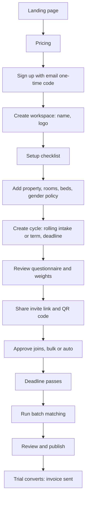
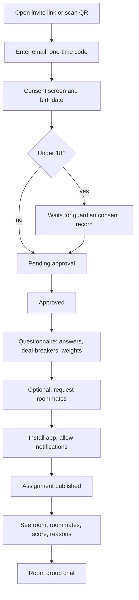
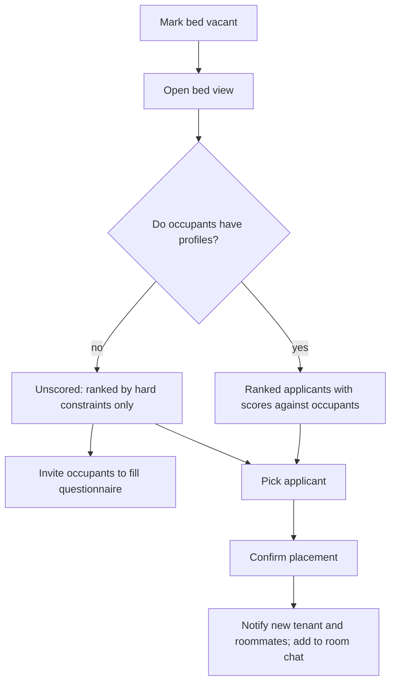
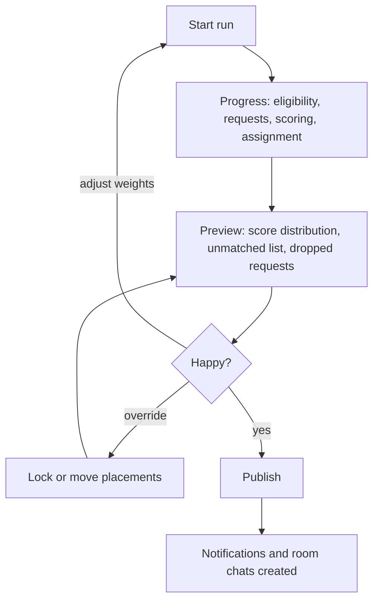
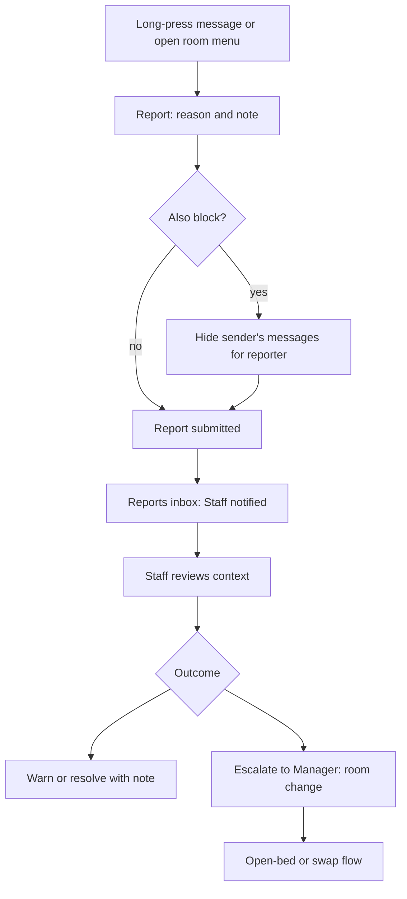
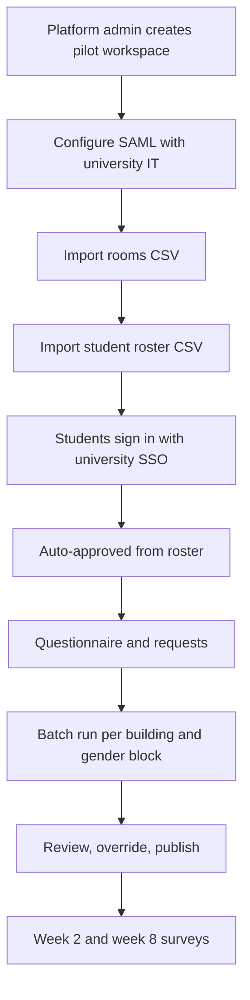

# DormMate — User Journeys

Oct 3, 2026 · Yhasmen Nogales · companion to the [PRD](prd.md)

Six journeys cover v1. Each lists its happy path step by step, the screens it touches (see the [site map](site-map.md)), the requirements it exercises, and its failure branches. Failure branches are where the edge-case rules live, so every one names what the user sees and what the system does.

| # | Journey | Primary persona | Requirements |
| --- | --- | --- | --- |
| 1 | Dorm owner: sign-up to first published assignment | Owner | A-1, A-2, A-3, A-5, A-6, A-8, A-10 |
| 2 | Student: invite link to room chat | Student | S-1 to S-9 |
| 3 | Filling an open bed | Manager | A-3, A-7, A-8, A-11 |
| 4 | Manager: review, override and publish a batch run | Manager | A-6, A-8, A-9 |
| 5 | Student report and staff escalation | Student, Staff | S-7, A-12, A-9 |
| 6 | University pilot with CSV import and single sign-on | Residence-life staff | A-4, A-16, S-1, A-6 |

---

## 1. Dorm owner: sign-up to first published assignment

**Goal:** a private dorm owner goes from finding DormMate to a published set of room assignments, with under an hour of their own setup time. **Trigger:** the owner sees a post in a Facebook dorm-owners group or gets a referral, two to three months before an intake.

| Step | What the owner does | What the system does | Screen |
| --- | --- | --- | --- |
| 1 | Reads the landing and pricing pages, clicks "Start free" | Explains the trial: free until the first published run, at most 60 days | `/`, `/pricing` |
| 2 | Enters email, then the one-time code | Creates the account and an empty workspace with the owner as Owner | `/signup` |
| 3 | Names the workspace, uploads a logo | Opens the setup checklist with four items | `/console/[ws]/setup` |
| 4 | Adds a property, rooms and bed counts, sets each room's gender policy | Validates capacities (2, 3 or 4) | `…/properties` |
| 5 | Creates a cycle: rolling intake, matching deadline | Starts the cycle in "collecting" state | `…/cycles/new` |
| 6 | Keeps the default habits-only questionnaire, nudges two weights | Saves a questionnaire version for the cycle | `…/cycles/[id]/questionnaire` |
| 7 | Copies the invite link into the dorm's group chat, prints the QR code for the lobby | Generates a link per cycle | `…/cycles/[id]/invite` |
| 8 | Optionally invites a caretaker as Manager | Sends an email invite | `…/settings/team` |
| 9 | Approves joins in bulk each evening | Records approvals in the audit log; emails students to start the questionnaire | `…/cycles/[id]/applicants` |
| 10 | After the deadline, runs matching | Runs the batch job and shows progress | `…/cycles/[id]/runs` |
| 11 | Reviews and publishes (see journey 4) | Notifies students; ends the trial; marks the workspace for invoicing | `…/runs/[runId]` |

**Failure branches**

| Branch | What the user sees | What the system does |
| --- | --- | --- |
| Owner abandons setup halfway | Checklist shows remaining items on next login | Sends one reminder email after 3 days |
| Trial reaches 60 days with no published run | Banner 7 days before; at the cap, the console becomes read-only except billing | Data is kept; publishing unlocks once an invoice is issued |
| Few students join before the deadline | Applicants page shows count against beds | Owner can extend the deadline or run anyway; unmatched students stay in the pool |
| Owner tries to publish without Manager rights | Not possible: Owner includes all Manager rights | — |
| Invite link leaked publicly | Strangers appear as pending applicants | Nobody is matched without approval; owner can rotate the link, which invalidates the old one |

---

## 2. Student: invite link to room chat

**Goal:** a student joins a dorm's cycle, fills in the questionnaire, optionally requests a friend, and ends up chatting with their roommates. **Trigger:** a link in a group chat, a QR code in the lobby, or an email invite.

| Step | What the student does | What the system does | Screen |
| --- | --- | --- | --- |
| 1 | Opens the link | Shows the dorm's name and logo, what DormMate is, and that it's free | `/join/[code]` |
| 2 | Enters email and the one-time code | Creates or reuses their global account | `/join/[code]` |
| 3 | Reads and accepts the consent screen, enters birthdate and gender (female, male, or prefer not to say) | Records consent with the questionnaire version; "prefer not to say" makes the student eligible only for rooms whose policy is "any" | `/app/onboarding/consent` |
| 4 | Waits for approval | Shows "pending"; auto-approves if their verified email is on a roster | `/app` |
| 5 | Fills in the questionnaire, marks one deal-breaker (smoking) | Saves a versioned profile; if they have a profile elsewhere, offers to copy answers after consent | `/app/profile/questionnaire` |
| 6 | Requests a friend by entering their email (there is no browsable list of other applicants) | The request shows "waiting for them" until the friend requests back; the friend gets an invite if they haven't joined | `/app/roommates` |
| 7 | Installs to home screen, taps "Turn on notifications" | Registers a push subscription | `/app/settings/notifications` |
| 8 | Edits answers before the deadline | Creates a new profile version | `/app/profile` |
| 9 | Gets a push and an email: "Your room is ready" | — | — |
| 10 | Opens the assignment | Shows room, roommates' first names, score and top reasons | `/app/assignment` |
| 11 | Says hello in the room chat | Delivers messages in real time | `/app/chat/[threadId]` |

**Failure branches**

| Branch | What the user sees | What the system does |
| --- | --- | --- |
| One-time code email does not arrive | "Resend code" after 60 seconds | Custom SMTP provider; per-user and per-IP rate limits apply |
| Student is under 18 | "Your dorm needs a guardian consent form before you can be matched" | Profile stays out of matching until staff record the consent date (A-11) |
| Join is rejected | "Your request to join wasn't approved" with the dorm's contact | No profile data is kept beyond 30 days |
| Friend never requests back | Request stays "waiting"; a hint before the deadline | One-sided requests are ignored by the engine |
| Mutual request can't fit (group too big, gender policy, deal-breaker) | Assignment page: "We couldn't place you with Ana because no room fits 5" | Each member is matched normally; staff saw the reason in the preview |
| Deadline passes with an incomplete profile | "Matching has closed; your dorm will place you manually" | Student appears on the unmatched list |
| Student is not placed (more students than beds) | "No bed was available this round" | Student stays in the pool for open-bed filling |
| iPhone student never installs the app | No push | Every notification also goes by email |
| Student wants out | Settings → export or delete data | Deletion removes profile and messages; audit events keep only an anonymized ID |

---

## 3. Filling an open bed

**Goal:** a tenant moves out mid-semester and the manager fills the bed with the best-fitting applicant. **Trigger:** a vacancy.

| Step | What the manager does | What the system does | Screen |
| --- | --- | --- | --- |
| 1 | Marks the departing tenant as moved out | Ends the occupancy, frees the bed, logs it | `…/properties/[id]/rooms/[roomId]` |
| 2 | Opens "Fill bed" | Lists approved applicants who pass the room's gender policy and the occupants' deal-breakers | `…/rooms/[roomId]/fill` |
| 3 | Reads the ranked list: score against each occupant, mean score, reasons | Uses the same pair score as batch runs, with occupants fixed | same |
| 4 | Picks the top applicant, confirms | Creates the placement, logs it as an open-bed decision | same |
| 5 | — | Notifies the new tenant; adds them to the room chat; posts a system message to the room | — |

**Failure branches**

| Branch | What the user sees | What the system does |
| --- | --- | --- |
| No occupant has a profile | "Unscored room" badge; applicants listed by join date | Sends occupants a questionnaire invite |
| Some occupants have profiles | Score shown with "based on 1 of 2 roommates" | Mean over occupants with profiles only |
| No applicant passes hard constraints | Empty list with the reasons applicants were excluded | Suggests sharing the invite link again |
| Chosen applicant is under 18 without consent recorded | Confirm button disabled with explanation | Staff can record consent date inline |
| Applicant and an occupant mutually requested each other | Applicant pinned to the top with a "requested" tag | Treated as a preference, since the occupant's bed is fixed |

---

## 4. Manager: review, override and publish a batch run

**Goal:** turn a matching run into published assignments that the manager can defend. **Trigger:** the cycle's deadline passes.

| Step | What the manager does | What the system does | Screen |
| --- | --- | --- | --- |
| 1 | Starts a run for the cycle | Queues a durable job; freezes inputs, weights and engine version | `…/cycles/[id]/runs` |
| 2 | Watches progress | Streams step status; a 2,000-applicant block targets under 60 seconds | `…/runs/[runId]` |
| 3 | Reads the preview | Score histogram, lowest-scoring rooms, unmatched students, dropped requests with reasons | same |
| 4 | Drags a student to another room, or locks a room | Re-scores the affected rooms; logs each override with an optional note | same |
| 5 | Optionally changes weights and re-runs | Keeps every run for comparison | `…/cycles/[id]/runs` |
| 6 | Publishes | Writes placements as occupancies, notifies students, creates one chat thread per room | same |

**Failure branches**

| Branch | What the user sees | What the system does |
| --- | --- | --- |
| Job fails or times out | Run marked failed with a retry button | Workflow retries steps automatically before failing |
| Staff (not Manager) opens the run | Read-only preview, no publish button | Enforced by row-level security and server checks |
| Override breaks a hard constraint | Warning naming the rule; requires a reason to proceed except for gender policy, which cannot be overridden | Logged with the reason |
| Two managers edit the same run | Second save shows a conflict | Optimistic locking on the run version |
| Manager needs to undo a publish | "Unpublish" within 24 hours, before move-in | Notifies affected students; logs the reversal |

---

## 5. Student report and staff escalation

**Goal:** a student flags a problem in the room chat and staff resolve it. **Trigger:** an abusive message, or an ongoing roommate conflict.

| Step | Who | What happens | Screen |
| --- | --- | --- | --- |
| 1 | Student | Reports a message or the room, with a reason (harassment, safety, conflict, other) | `/app/chat/[threadId]` |
| 2 | Student | Optionally blocks the sender, which hides their messages from the reporter but keeps them for staff | same |
| 3 | System | Creates a report, notifies Staff by email and push, logs it | — |
| 4 | Staff | Reviews the reported messages and surrounding context | `…/reports/[reportId]` |
| 5 | Staff | Resolves with a note, or escalates to a Manager for a room change | same |
| 6 | Manager | Moves a student using the open-bed flow (journey 3) | `…/rooms/[roomId]/fill` |

**Failure branches**

| Branch | What the user sees | What the system does |
| --- | --- | --- |
| Report describes immediate danger | Reporter sees emergency contacts and the dorm's phone number | Report marked urgent and emailed to every Manager and Owner |
| Message matches the keyword filter | Sender sees "message not sent" | Message is held for staff review |
| Sender exceeds rate limits | "Slow down" notice | Messages rejected for a short window |
| Students block each other in a shared room | Both remain in the room; chat is effectively muted between them | Staff are notified, since a mutual block signals conflict |
| Report left unresolved for 72 hours | — | Reminder to the Owner |

---

## 6. University pilot with CSV import and single sign-on

**Goal:** a university housing office runs a full term in DormMate. **Trigger:** a signed university pilot for an upcoming academic term. Single sign-on (A-16) is P1, so this journey lands with Phase 4.

| Step | Who | What happens | Screen |
| --- | --- | --- | --- |
| 1 | Platform admin | Creates the workspace on the University pilot tier and invites the housing director as Owner | `/admin/workspaces` |
| 2 | Owner and university IT | Exchange SAML metadata; test sign-in | `…/settings/sso` |
| 3 | Manager | Uploads the rooms CSV; fixes rows flagged with errors | `…/import` |
| 4 | Manager | Uploads the student roster CSV | `…/import` |
| 5 | Student | Signs in with university credentials; auto-approved because they are on the roster | `/login` |
| 6 | Student | Questionnaire and requests as in journey 2 | `/app/…` |
| 7 | Manager | Runs matching in blocks by building, gender policy and room type | `…/cycles/[id]/runs` |
| 8 | Manager | Reviews, overrides and publishes as in journey 4 | `…/runs/[runId]` |
| 9 | Students | Answer check-in surveys at weeks 2 and 8 (S-11) | `/app/surveys/[id]` |

**Failure branches**

| Branch | What the user sees | What the system does |
| --- | --- | --- |
| CSV has bad rows | Row-by-row errors (missing email, unknown room, invalid capacity) | Valid rows import; invalid rows are downloadable for fixing |
| Student not on the roster signs in with SSO | "Pending approval" | Manager approves manually |
| SAML setup stalls with IT | Owner can fall back to email one-time codes for the pilot | Logged as a pilot risk |
| Block too large for 60 seconds | Progress continues; run takes longer | Benchmark data decides whether to split blocks further |
| University privacy officer requests the data-processing agreement | Downloadable agreement naming Singapore as sub-processor location | Request form on the marketing site |
